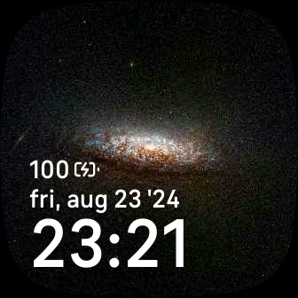
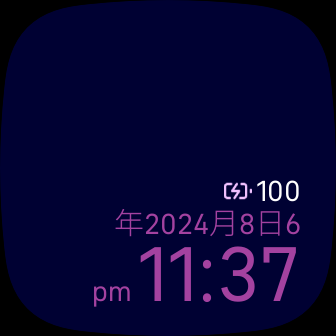

# Chronos

 

A minimalist digital clock face for Fitbit watches.

Credit for the CC BY 2.0 licensed [background image] goes to NASA, ESA, STScI, David Thilker (JHU).

The color palette is courtesy of [colors.lol].

[background image]: https://www.flickr.com/photos/nasahubble/53805163612/in/album-72157667717916603
[colors.lol]: https://colors.lol/podgy

## Building

Chronos can be built with `npx fitbit-build` for the following devices:

* Versa 3 (`atlas`)
* Sense (`vulcan`)
* Versa 4 (`hera`)
* Sense 2 (`rhea`)

As neither Fitbit OS SDK 6 nor 7 can target all 4 devices, the pre-release version 6.2.0-pre.1 is used.
This allows Chronos to be tested on the [Fitbit Simulator] due to its lack of Versa 4/Sense 2 support.

[Fitbit Simulator]: https://dev.fitbit.com/getting-started

## License

Chronos is made freely available under the MIT License.
